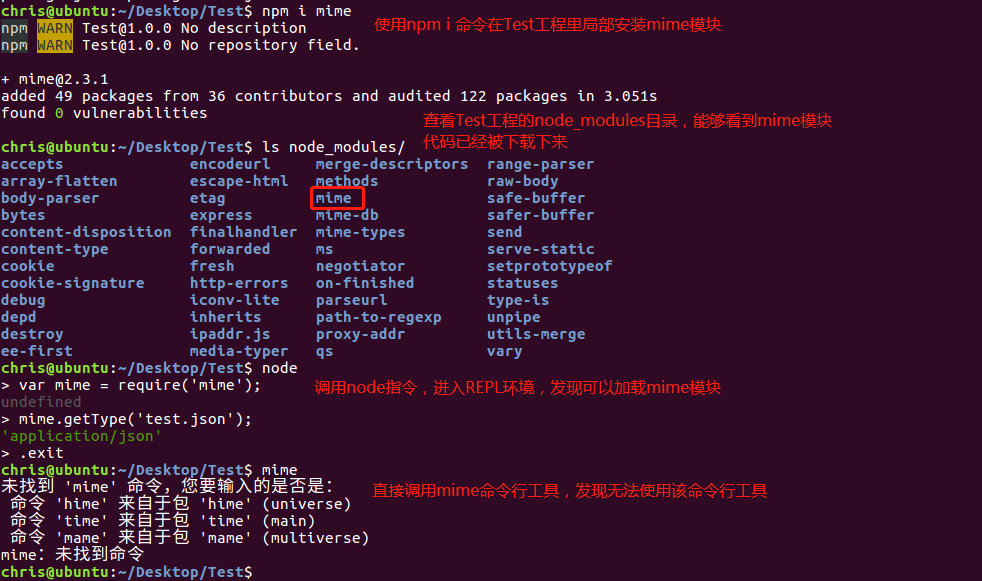
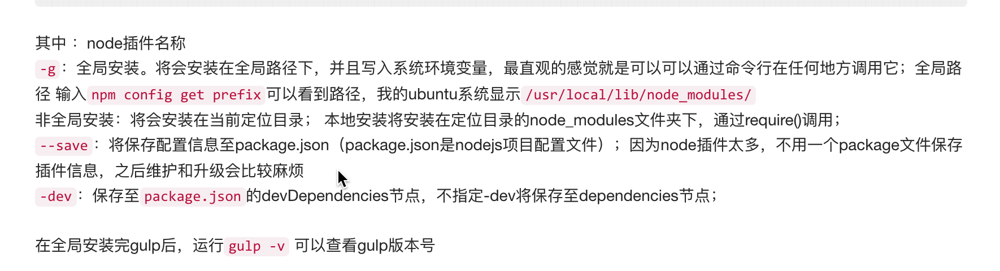
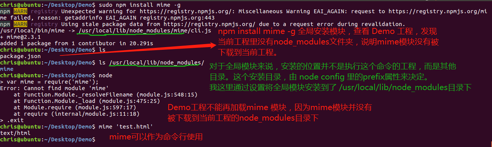
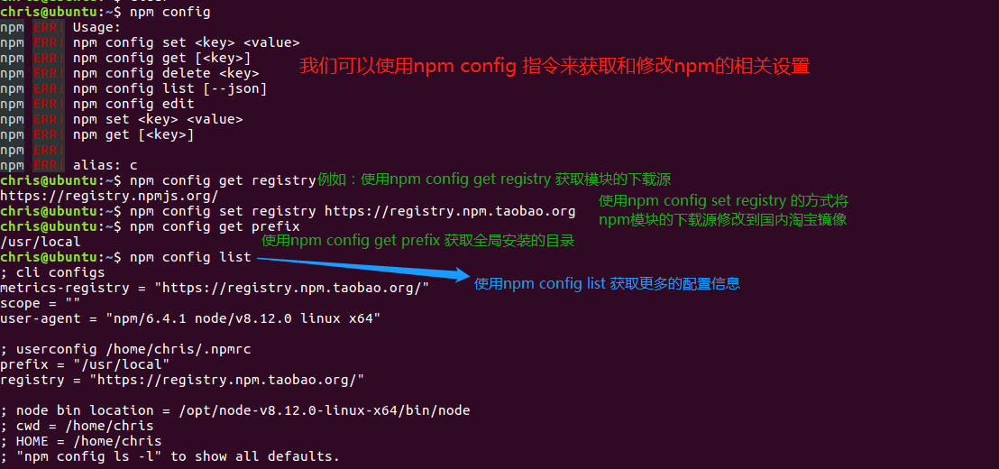
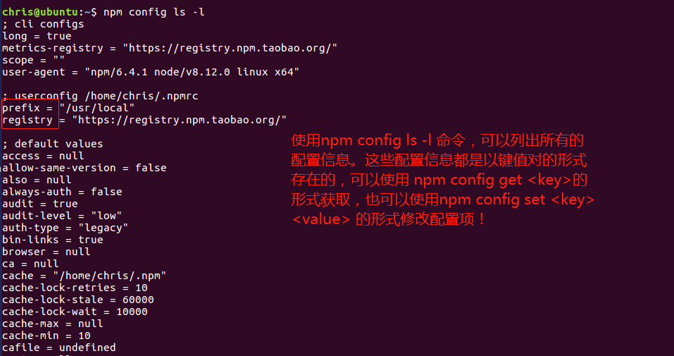

#NPM

## NPM 是什么？

​    NPM（node package manager），通常称为 **node包管理器**。顾名思义，它的主要功能就是管理node包，(包括：安装、卸载、更新、查看、搜索、发布等 )。

​    npm 详细记录了每个包的信息，包括作者、版本、依赖、授权信息等。它的一个很重要的作用就是：**将开发者从繁琐的包管理工作（版本、依赖等）中解放出来，更加专注于功能的开发。**

 [npm官网]( https://npmjs.org/)
 [npm 中文官网](https://npm.js.cn/)

[npm官方文档](https://npmjs.org/doc/README.html)

## 如何安装、更新 NPM

- 安装完毕 node.js  后会自动安装  npm 

- 查看当前 npm 版本：`npm -v `   

- 更新升级  npm：  

  ```js
  //以下三种方式都可以
  // npm i npm -g   //  --global
  // npm i npm@latest -g 
  // npm i npm@5.5.3 -g   指定版本
  ```

- 降级 npm:  `npm i npm@3.10.10 -g    // @后面指定具体版本号`    

## npm常用命令介绍

1. **npm** —> 可以查看命令参数信息 

2. **npm init  /  npm init -y **  :  创建一个 npm 的配置文件: package.json 。`npm init`  (不推荐),   `npm init -y ` (推荐)

   ```js
   Package.json 的作用:  保存安装记录, 下次安装的时候,根据记录直接安装依赖的包
   
   npm init -y 使用的注意点:
   1. 文件夹名不能有中文
   2. 也不能有空格
   ```

   package.json文件里的内容：

   ```javascript
   {
     "name": "05-hackernews",
     "version": "1.0.0",
     "description": "",
     "main": "index.js",
     "scripts": {
       "test": "echo \"Error: no test specified\" && exit 1"
     },
     "keywords": [],
     "author": "",
     "license": "ISC",
     "dependencies": {
       "mime": "^2.0.3"
     }
   }
   ```

3. **npm i 包名  == npm install 包名   :  安装包  ** 。`例: npm i mime`

   注意：该命令是将指定的模块安装到当前工程里，作为当前工程的一个模块，无法作为命令行使用。

   

4. **npm i 包名 --global == npm i 包名 -g**。全局安装指定的模块。`例:npm i express -g`

   注意：-g是一种全局的安装方式，使用这种方法安装的模块，***不是*** 保存在当前项目的node_modules文件夹里，在全局都可以使用。

   

   

5. **npm un 包名 == npm uninstall  包名  :  卸载包()** 。 `例: npm un mime`

6. **npm  -v **，查看当前npm版本。

7. **--save == -S**  :  把下载名称保存在 package.json 里的 **dependencies**

8. **--save -dev  == -SD  == -D** :  把下载名称保存在 package.json 里的 **devDependencies**  (开发阶段)

9. **npm config**可以查看和修改npm配置

   

   


## NPM 包安装模式

>  本地安装 vs 全局安装

- 本地安装：包会被下载到当前所在目录，也只能在当前目录下使用。

  ```bash
    npm i <packagename> -S/-SD/-D
  ```

- 全局安装：包会被下载到到特定的系统目录下，变成一个命令行工具。

  ```` js
  npm 全局安装指的是把`包``安装成`了一个`命令行工具`。
  ````

- 举例 : 

```javascript
  // 通过npm全局安装mime
  npm install mime -g

  //安装完毕后可以在命令行中直接使用
  mime a.txt 命令来查看对应的结果
```

## "模块"（Modules）和"包"（Packages） 

1. A **module** is any file or directory that can be loaded by Node.js' `require()`. 

- 模块可以是任何一个文件或目录（目录下可以有很多个文件），只要能被node.js通过require()即可。
- **在 node 的世界里,每一个文件都是一个模块**;

2. A **package** is a file or directory that is described by a `package.json`. This can happen in a bunch of different ways!

- 包是一个文件或目录（目录下可以有多个文件）必须有一个package.json文件来描述，就可以是一个包。
- 总结: 模块包括包。

## 修改下载源

从npm上下载软件时，默认的下载源是 https://registry.npmjs.org/ ,这个域名对应的服务器在国外，国内访问时效率略低。可以修改npm的默认下载源，将下载源修改为国内网站。

国内比较常用的是淘宝镜像源。

```bash
//淘宝镜像
npm config set registry https://registry.npm.taobao.org
//检测是否设置成功
npm config get registry
```

# 其他包管理工具

## cnpm

因为npm安装插件是从国外服务器下载，受网络影响大，可能会出现异常，所以淘宝团队就干了件事，就是将npm官网上的内容镜像到国内的服务器，并且保持以十分钟一次的频率进行同步，尽量与npm官方保持一致。

```bash
1. npm 安装 cnpm  
   npm i cnpm -g
2. 检查  cnpm   
    cnpm -v
3. 安装其他包:
   cnpm  i <packagename> -S
```

cnpm命令的使用方式和npm完全一致，只不过在使用时，将命令名 npm 修改为 cnpm.

cnpm作为国内的镜像，可以提高下载插件的速度，但是，它也有自己的局限性：

1. cnpm 的仓库只是 npm 仓库的一个拷贝，它不承担 publish 工作，所以你用 cnpm publish 命令会执行失败的。

2. 不仅是 publish 会执行失败，其它的需要注册用户(npm adduser)、或者修改 package 状态等命令都无法用 cnpm。

## yarn

```bash
1. npm 安装 yarn  
   npm i yarn -g
2. 检查  yarn   
    yarn -v
3. 安装其他包:
   yarn add <packagename>
   
   yarn add 包名        本地
   yarn add 包名  -g    全局
```

# 模板引擎的使用

art-template是由腾讯公司开发的一款简约、超快的模板引擎。它采用作用域预声明的技术来优化模板渲染速度，从而获得接近 JavaScript 极限的运行性能，并且同时支持 NodeJS 和浏览器。它有以下几个特性：

1. 拥有接近 JavaScript 渲染极限的的性能

2. 调试友好：语法、运行时错误日志精确到模板所在行；支持在模板文件上打断点（Webpack Loader）

3. 支持 Express、Koa、Webpack

4. 支持模板继承与子模板

5. 浏览器版本仅 6KB 大小

我们主要从数据渲染，模板语法和继承这几个方面来介绍art-template.

## art-template的安装

art-template分为浏览器和服务器两个版本。如果要在浏览器端使用art-template，可以直接从官网上下载template-web.js文件，并在HTML页面里引入并使用。下载地址: https://unpkg.com/art-template@4.13.1/lib/template-web.js.

node服务器端需要使用npm 进行安装。

```bash
npm install art-template
```

## 数据渲染

数据渲染主要有template、render和compile三个函数来对模板进行渲染。数据渲染又分为浏览器端渲染和服务器渲染两个部分，但是不管是浏览器端还是服务器端，都是使用这三个函数实现，只不过实现的方式略有不同。

浏览器端的数据渲染：

```html
<!doctype html>
<html lang="en">
<head>
  <meta charset="UTF-8">
  <title>Document</title>
  <!-- 1. 引入 template-web.js 文件 -->
  <script src="template-web.js"></script>
</head>
<body>

<!-- 2. 定义一个模块 -->
<script type="text/template" id="hello">
  <p>大家好，我是{{name}},我今年{{age}}岁了</p>
</script>

<script>
  // 3. 加载该模块
  var html = template('hello',{name:'张三',age:18});
  document.body.innerHTML = html;
</script>
</body>
</html>
```

我们本次学习以服务端的数据渲染为例。

### template方法

```javascript
语法：
template(filename,content)
```

根据模板名称加载该模板。content参数可以是一个对象，也可以是一个字符串。

 

1. 如果content参数是一个对象，那么会加载这个模板，并且返回加载模板后的字符串。

```javascript
示例：

var template = require('art-template');

//传递的content参数是一个对象，返回值结果是一个字符串

var html = template(__dirname + '/test.html',{name:'张三'});

console.log(html);   //输出test.html里的内容

```

2. 如果content参数是一个字符串，会编译这个模块，并且返回一个函数。

```javascript
//传入的content参数是一个字符串，而不是一个对象
//返回值结果是一个函数，它会将content字符串编译成模板并缓存
var result = template('hello.art','hi,{{name}}');

//调用这个函数传入数据，使用模板。
result({name:'zhangsan'});
```

### .render方法

编译一段模板代码，并且返回渲染结果。

```javascript
语法:
require(source,data,options)

var template = require('art-template');
var html = template.render('hi,{{name}}',{name:'张三'});
```

### .compile方法

编译一段模板代码并且返回这个渲染函数。

```javascript
var template = require('art-template');

//compile函数的执行结果也是一个函数
var html = template.compile('<h1>hi,{{name}}</h1>')({name:"张三"});
```

## 模板语法

art-template支持原生语法和简洁语法，我们重点学习简洁语法。

### 输出语句

```javascript
{{value}}
{{data.key}}
{{data['key']}}
{{a ? b : c}}
{{a || b}}
{{a + b}}

前端模板:
<div>你好,{{name}}</div>

后端渲染:
var html = template(__dirname + 'test.html',{name:'<h1>张三</h1>'})

前端不会解析标签，会直接显示标签里的内容
```


### 编译并输出

```javascript
{{@ value }}
 
 前端模板:
<div>你好,{{@ name}}</div>

后端渲染:
var html = template(__dirname + 'test.html',{name:'<h1>张三</h1>'})

前端会解析标签在浏览器上渲染标签
```

### 条件判断语句

```javascript
{{if value}} ... {{/if}}
{{if v1}} ... {{else if v2}} ... {{/if}}

前端模板：
{{if score > 80}}
<p>优秀</p>
{{else if score > 60}}
<p>及格</p>
{{else}}
<p>不及格</p>
{{/if}}

后台渲染:
var html = tempalte(__dirname + 'test.html',{score:67});
```

### 循环语句

```javascript
{{each target}}
{{$index}} {{$value}}
{{/each}}
  
模板代码：
{{each scores}}
  <li>第{{$index + 1}}个成绩是{{$value}}</li>
{{/each}}
后台代码：
var html = template(__dirname + '/test.html', {scores: [34, 56, 75]});
```

也可以定义变量，用来保存遍历出来的数据。

```javascript
模板代码：
<ul>
  	{{each students as student}}
	  <li>
	第{{$index}}个学生的姓名是{{student.name}},成绩是{{student.score}}
  </li>
	{{/each}}
	</ul>
后台代码：
var html = template(__dirname + '/test.html',
{students:[
	   	{name:'zhangsan',score:98},
    	{name:'lisi',score:96},
	    {name:'wangwu',score:89},
    	{name:'hellen',score:87},
	    {name:'jerry',score:80},
  	]});
```

## 模板继承

art-template的模板之间也可以继承。使用关键字block用来定义代码块，再使用extend关键字来继承代码块。

base.html

```html
<html lang="en">
	<head>
		<meta charset="UTF-8">
		<title>{{block 'title'}}My Site{{/block}}</title>
        {{block 'head'}}
           <link type='stylesheet' href='bootstrap.css'/>
        {{/block}}
    </head>
	<body>
	{{block 'content'}}{{/block}}
	</body>
</html>
```

在base.html里定义定义了title、head和content三个代码块。

demo.html

```html
{{extend './base.html'}}
{{block 'title'}} {{title}} {{/block}}
{{block 'content'}} {{@ content}} {{/block}}
```

demo.html继承自base.html，那么base.html里定义的代码块，在demo.html里都可以直接使用。

服务器返回信息：

```javascript
var html = template(__dirname+'/demo.html',{title:'首页',content:'<h1>大家好，我是内容</h1>'});
```

# HackerNews 网站案例

[模仿网站 HackerNews](https://news.ycombinator.com/)