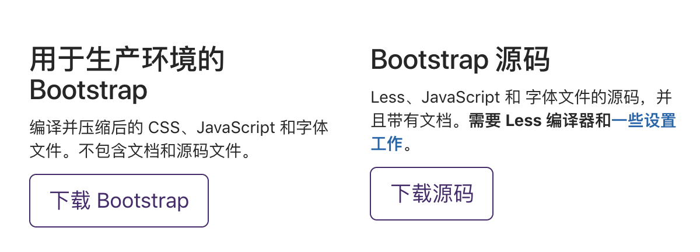
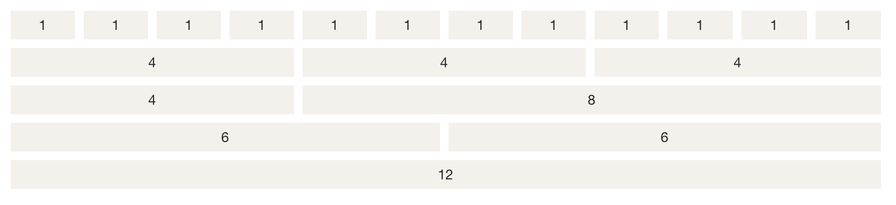
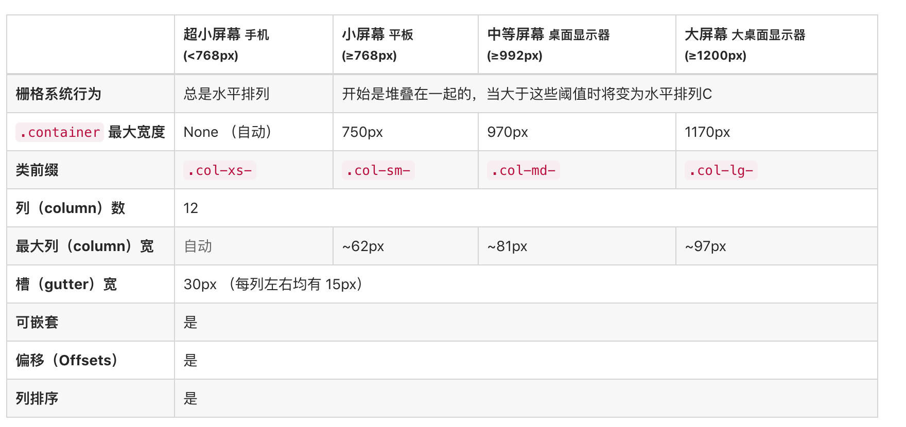

# 介绍

Bootstrap 是由 *Twitter*公司 的 *Mark Otto* 和 *Jacob Thornton* 开发，并于 2011 年八月在 GitHub 上发布的开源产品。它基于 HTML、CSS、JAVASCRIPT 的，它简洁灵活，使得 Web 开发更加快捷。

# 特点

**移动设备优先**：自 Bootstrap 3 起，框架包含了贯穿于整个库的移动设备优先的样式。

**浏览器支持**：所有的主流浏览器都支持 Bootstrap。

**容易上手**：只要您具备 HTML 和 CSS 的基础知识，您就可以开始学习 Bootstrap。

**响应式设计**：Bootstrap 的响应式 CSS 能够自适应于台式机、平板电脑和手机。

**易于定制：**Bootstrap提供了功能强大的内置组件，易于定制。

# 安装

[Bootstrap中文网](http://www.bootcss.com/)



如果只是需要使用Bootstrap，直接下载Bootstrap即可；如果想要学习Bootstrap源码，可以点击下载源码。

# 栅格系统（了解）

Grid System，是Bootstrap 提供的一套响应式、移动设备优先的流式栅格系统，随着屏幕或视口（viewport）尺寸的增加，系统会自动分为最多12列。它包含了用于简单的布局选项的预定义类，也包含了用于生成更多语义布局的功能强大的混合类。



## 工作原理

栅格系统通过一系列包含内容的行和列来创建页面布局。下面列出了Bootstrap栅格系统是如何工作的：

- 行必须放置在 **.container** class 内，以便获得适当的对齐（alignment）和内边距（padding）。
- 使用行来创建列的水平组。
- 内容应该放置在列内，且唯有列可以是行的直接子元素。
- 预定义的网格类，比如 **.row** 和 **.col-xs-4**，可用于快速创建网格布局。
- 列通过内边距（padding）来创建列内容之间的间隙。该内边距是通过 **.rows** 上的外边距（margin）取负，表示第一列和最后一列的行偏移。
- 网格系统是通过指定您想要横跨的十二个可用的列来创建的。例如，要创建三个相等的列，则使用三个 **.col-xs-4**。

## 布局参数



## 示例代码

```html
<body>
  <div class="container">
    <h1>Hello, world!</h1>
    <div class="row">
      <div class="col-xs-2 col-sm-3 col-md-6 col-lg-8" style="background-color: #dedef8; 
           box-shadow: inset 1px -1px 1px #444, 
           inset -1px 1px 1px #444;">
        <p>Lorem ipsum dolor sit amet, consectetur adipisicing elit, sed do
          eiusmod tempor incididunt ut labore et dolore magna aliqua. Ut
          enim ad minim veniam, quis nostrud exercitation ullamco laboris
          nisi ut aliquip ex ea commodo consequat.
        </p>
  
        <p>Sed ut perspiciatis unde omnis iste natus error sit voluptatem
          accusantium doloremque laudantium, totam rem aperiam, eaque ipsa
          quae ab illo inventore veritatis et quasi architecto beatae vitae
          dicta sunt explicabo.
        </p>
      </div>
  
      <div class="col-xs-10 col-sm-9 col-md-6 col-lg-4" style="background-color: #dedef8;
           box-shadow: inset 1px -1px 1px #444, 
           inset -1px 1px 1px #444;">
        <p>Sed ut perspiciatis unde omnis iste natus error sit voluptatem
          accusantium doloremque laudantium.
        </p>
  
        <p> Neque porro quisquam est, qui dolorem ipsum quia dolor sit amet,
          consectetur, adipisci velit, sed quia non numquam eius modi
          tempora incidunt ut labore et dolore magnam aliquam quaerat
          voluptatem.
        </p>
      </div>
    </div>
  </div>
</body>
```

# 常用组件

## 字体图标

```html
<span class="glyphicon glyphicon-education">hello</span>
```

## BootStrap图片

```html


```

## 其他常用组件

```html
<div class="container">
  <!-- 巨幕 -->
  <div class="jumbotron">
    <h1>Hello, world!</h1>
    <p>欢迎来到王者荣耀！</p>
    <p><a class="btn btn-primary btn-lg" href="#" role="button">Learn more</a></p>
  </div>

  <!-- 缩略图 -->
  <div class="row">
    <div class="col-sm-6 col-md-4">
      <div class="thumbnail">
        
        <div class="caption">
          <h3>Thumbnail label</h3>
          <p>Cras justo odio, dapibus ac facilisis in, egestas eget quam. Donec id elit non mi porta gravida at eget metus. Nullam id dolor id nibh ultricies vehicula ut id elit.</p>
          <p><a href="#" class="btn btn-primary" role="button">Button</a> <a href="#" class="btn btn-default" role="button">Button</a></p>
        </div>
      </div>
    </div>
    <div class="col-sm-6 col-md-4">
      <div class="thumbnail">
        
        <div class="caption">
          <h3>Thumbnail label</h3>
          <p>Cras justo odio, dapibus ac facilisis in, egestas eget quam. Donec id elit non mi porta gravida at eget metus. Nullam id dolor id nibh ultricies vehicula ut id elit.</p>
          <p><a href="#" class="btn btn-primary" role="button">Button</a> <a href="#" class="btn btn-default" role="button">Button</a></p>
        </div>
      </div>
    </div>
    <div class="col-sm-6 col-md-4">
      <div class="thumbnail">
        
        <div class="caption">
          <h3>Thumbnail label</h3>
          <p>Cras justo odio, dapibus ac facilisis in, egestas eget quam. Donec id elit non mi porta gravida at eget metus. Nullam id dolor id nibh ultricies vehicula ut id elit.</p>
          <p><a href="#" class="btn btn-primary" role="button">Button</a> <a href="#" class="btn btn-default" role="button">Button</a></p>
        </div>
      </div>
    </div>
  </div>

  <div class="alert alert-warning alert-dismissible" role="alert">
    <button type="button" class="close" data-dismiss="alert" aria-label="Close"><span aria-hidden="true">&times;</span></button>
    <strong>Warning!</strong> Better check yourself, you're not looking too good.
  </div>

  <!-- 警告 -->
  <div class="alert alert-success" role="alert">
    <a href="#" class="alert-link">Well done! You successfully read this important alert message.</a>
  </div>
  <div class="alert alert-info" role="alert">
    <a href="#" class="alert-link">Heads up! This alert needs your attention, but it's not super important.</a>
  </div>
  <div class="alert alert-warning" role="alert">
    <a href="#" class="alert-link">Warning! Better check yourself, you're not looking too good.</a>
  </div>
  <div class="alert alert-danger" role="alert">
    <a href="#" class="alert-link">Oh snap! Change a few things up and try submitting again.</a>
  </div>

  <!-- 可关闭的警告 -->
  <div class="alert alert-warning alert-dismissible" role="alert">
    <button type="button" class="close" data-dismiss="alert" aria-label="Close"><span aria-hidden="true">&times;</span></button>
    <strong>Warning!</strong> Better check yourself, you're not looking too good.
  </div>
</div>
```

# JavaScript插件（了解）

Bootstrap 包含了十几个自定义的 jQuery 插件。您可以直接包含所有的插件，也可以逐个包含这些插件。

```html
<!DOCTYPE html>
<html>
<head>
  <meta charset="utf-8">
  <title>Bootstrap 实例 - 弹出框（Popover）插件</title>
  <link rel="stylesheet" href="../css/bootstrap.css">
  <script src="../js/jquery-1.12.4.js"></script>
  <script src="../js/bootstrap.js"></script>
</head>
<body>

<div class="container" style="padding: 100px 50px 10px;" >
  <button type="button" class="btn btn-default" title="Popover title"
          data-container="body" data-toggle="popover" data-placement="left"
          data-content="左侧的 Popover 中的一些内容">
    左侧的 Popover
  </button>
  <button type="button" class="btn btn-primary" title="Popover title"
          data-container="body" data-toggle="popover" data-placement="top"
          data-content="顶部的 Popover 中的一些内容">
    顶部的 Popover
  </button>
  <button type="button" class="btn btn-success" title="Popover title"
          data-container="body" data-toggle="popover" data-placement="bottom"
          data-content="底部的 Popover 中的一些内容">
    底部的 Popover
  </button>
  <button type="button" class="btn btn-warning" title="Popover title"
          data-container="body" data-toggle="popover" data-placement="right"
          data-content="右侧的 Popover 中的一些内容">
    右侧的 Popover
  </button>
</div>
<script>
  $(function () {
    $("[data-toggle='popover']").popover();
  });
</script>

</body>
</html>
```

# 附录：

[Bootstrap可视化开发工具](https://www.runoob.com/try/bootstrap/layoutit/)