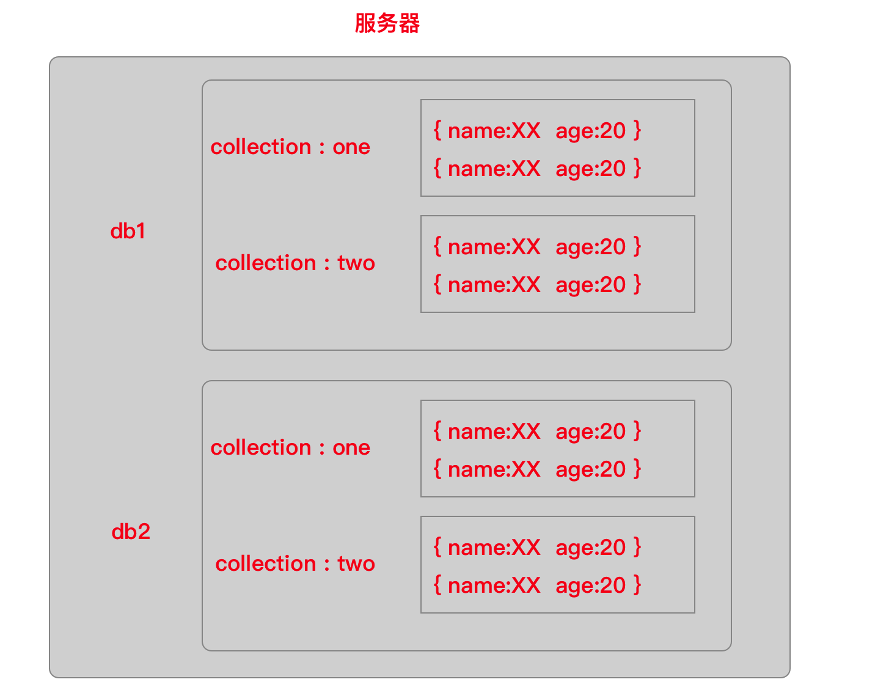
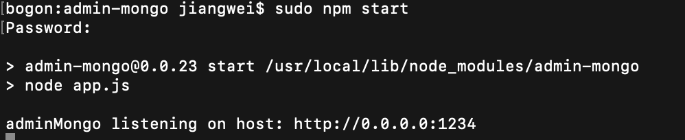
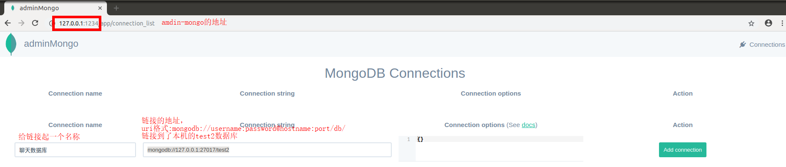
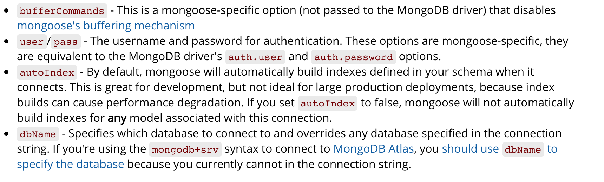
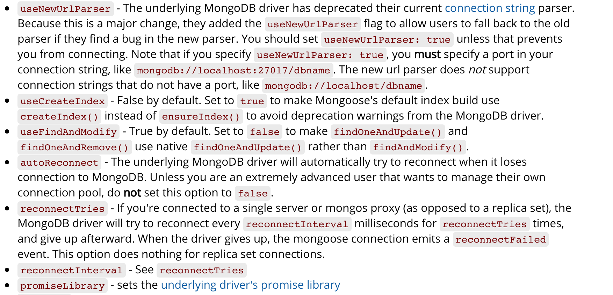
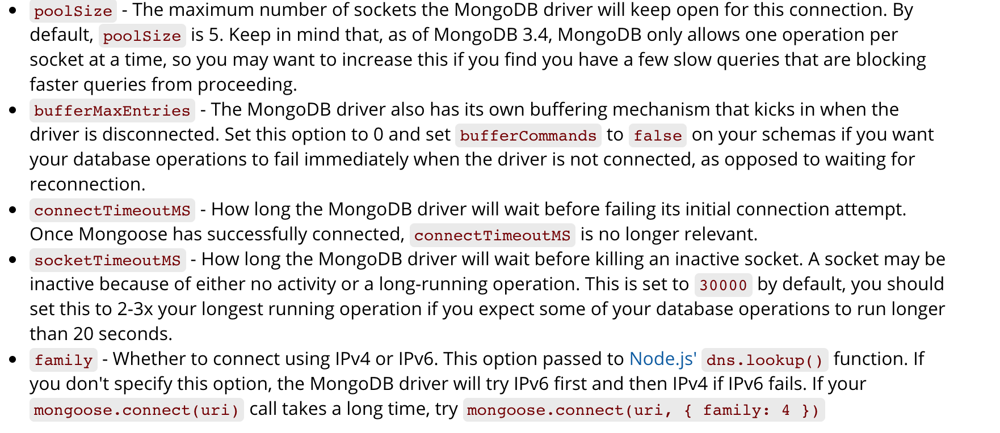
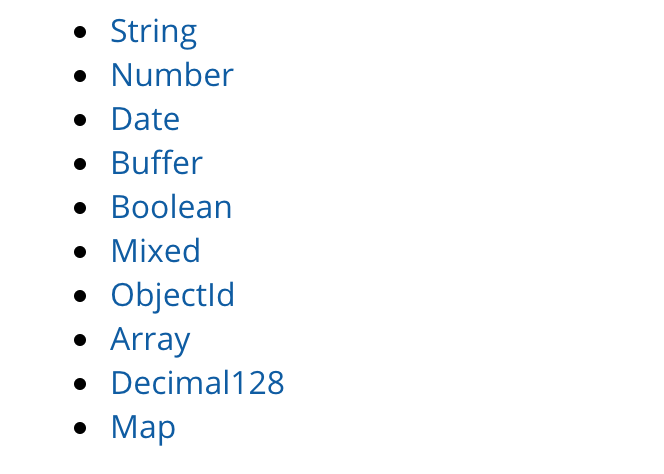
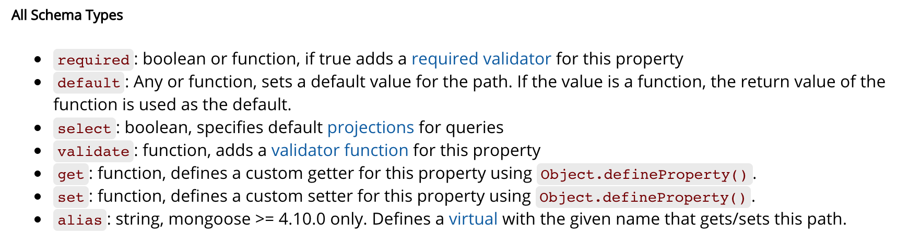
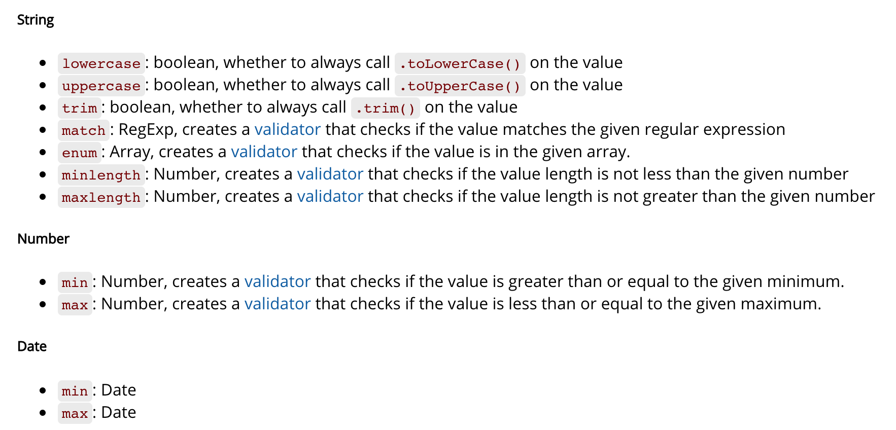

# MongoDB 介绍:

MongoDB是一个跨平台，面向文档的数据库，高性能，高可用性和易于扩展。

## 概念

- 数据库:数据库是一个集合的物理容器,一个单一的MongoDB服务器通常有多个数据库。
- 集合:集合是一组MongoDB的文件。简单理解就是一个数组   (集合里面存放 json 对象   collection('one');
- 文档 : 文档是一组键值对。(可以认为是 json 格式,但其实是 bson,  bson 基于 json 格式)  

## 为什么选择 MongoDB?

- 学习成本较低
- 和 Node.js 结合最好,  对 javascript 兼容较好

## 官网链接:

- [英文官网 -  https://www.mongodb.com/](https://www.mongodb.com/)
- [中文官网 - https://www.mongodb.com/cn](https://www.mongodb.com/cn)
- [菜鸟教程 - http://www.runoob.com/mongodb/mongodb-tutorial.html](http://www.runoob.com/mongodb/mongodb-tutorial.html)

# 安装: 

## ★ win 安装:  

- 下载安装
- 根据系统版本下载指定的安装包:[下载官网](https://www.mongodb.com/download-center/community)

## ★ ubuntu安装：

+ 下载安装包，并解压

+ 在 ~/.bashrc文件里添加

  ```bash
  export PATH = <mongodb-install-directory>/bin:$PATH
  ```

  把mongodb-install-directory替换成mongodb解压后所在的文件夹。

## ★ mac 安装 :  

+ 下载安装包，并解压

+ 在 ~/.bash_profile文件里添加

  ```bash
  export PATH = <mongodb-install-directory>/bin:$PATH
  ```

  把mongodb-install-directory替换成mongodb解压后所在的文件夹。

# 启动连接 mongodb

> [win-mongodb 使用](https://docs.mongodb.com/manual/tutorial/install-mongodb-on-windows/)
>
> [mac-mongodb 使用](https://docs.mongodb.com/manual/tutorial/install-mongodb-on-os-x/)
>
> [ubuntu-mongodb使用](https://docs.mongodb.com/manual/tutorial/install-mongodb-on-ubuntu/)

## (一)、启动数据库服务器(win版)

1. 创建目录 `c:\data\db\ `  

   ```js
   - 如果使用这个路径 `c:\data\db\\`,就可以直接使用第二步,
    
   -  else 
   - 在启动的时候，也可以通过 `--dbpath` 指定数据服务存储数据的目录  // 目录可以通知点击地址栏获取
   - 例如: `mongod --dbpath 自定义目录`    // ` mongod --dbpath D:\mongo-data`

   -  如果不加--dbpath, mongod 会自动使用 `执行命令所属磁盘根目录`下面的/data/db 目录作为自己的数据存储路径，
   ```

2. 在命令行输入 **mongod** 启动服务  (注意 :  不是 mongodb 也不是 mongo)

   ```js
   > mongod                             // mac 下 要使用 sudo mongod 
   // 如果出现下面这句话才算 OK    
   // 并且光标停在最左边
   > ....  waiting for connections on port 27017 
   ```

3. **[ 切记 ] **停止服务：按 ctr + c，不要直接通过关闭 cmd 窗口的方式来关闭
   - 任务管理器 关闭进程
   - 找到 `mongod.lock` 删掉

## (二)连接数据库 服务器:

1. **再打开一个 cmd 窗口**

2. 通过 **mongo** 命令连接数据库服务器

   ```js
   mongo 命令默认去连接本机上的 MongoDB 服务端口为：`127.0.0.1:27017`
   也可以通过下面的命令，指定连接的主机名和端口号：
   `mongo --host 127.0.0.1 --port 27017`
   ```

## (一)启动数据库(Ubuntu版)

1. 创建 `/data/db`  目录 ;  

```bash
sudo mkdir -p /data/db  #-p  用来创建多级目录
sudo chown -R <user> /data  #修改文件夹的所有者为当前用户，否则没有写入权限
```

2. 开启数据库服务器:  

```bash
# 使用默认路径开启
 sudo mongod  # 如果 /data/db 目录不存在，会报错

# 还可以指定数据库路径
sudo mongd --dbpath /Users/chris/Desktop/db

: waiting for connections on port 27017  # 表示开启成功
```

3. 停止服务：

按 ctr + c，不要直接通过关闭终端 窗口的方式来关闭。如果终端已经被关闭，可以使用ps命令或者lsof命令来关闭mongod

```bash
 #查看mongod进程
 ps -aef | grep mongo
 # 命令行执行结果
 501 10576 6955 0 5:44下午 ttys002   0:00.0 grep mongo
 sudo kill 6955  # 杀掉mongod进程
 
 # 也可以通过端口号来关闭mongod进程
 lsof -i:27017 # mongod的默认端口号是27017
 # 命令行执行结果
 mongod  6955 jiangwei    9u  IPv4 0xb5bd0d7a3b63615d      0t0  TCP localhost:27017 (LISTEN)
 sudo kill 6955 # 杀掉进程
```

## (二)连接数据库 服务器:

- 再打开一个终端窗口

- 执行`mongo`命令,连接数据库服务器

- mongo 命令,默认去连接本机上的 MongoDB 服务实例: `127.0.0.1:27017`    {一定要记住这个端口号}

   ```js
   mongo --host 127.0.0.1 --port 27017
   ```

   > 提示：如果提示 “无法连接主机”，请检查你的 MongoDB 数据服务实例是否开启。

## 总结:

1. #####开启数据库服务器: `mongod`  / `sudo mongod` 

2. #####连接....................: `mongo`

3. #####关闭....................: `Ctr+C`

# 基本操作命令



1. 查看服务器里所有的数据库  :  `show dbs`

```
> show dbs
admin       0.000GB
config      0.000GB
local       0.000GB
```

2.  切换 / 创建数据库 : `use 数据库名称`

```
> use test
switched to db test
```

如果在创建的数据库里,不创建集合, 那么,退出后,数据库也就消失了;

(简单了解即可) 连接到数据库之后，默认有一个变量叫做：db，终端默认把 db 赋值给了 test

3.  查看当前所处的数据库 : `db`

```
> db
test //(如果没有指定具体的数据库就会返回一个测试的: test)
```

4. 创建集合并插入`一条` 数据 : `db. 集合名称. insertOne ( 数据文档 )`

```
> db.users.insertOne({id:1,name:'zhangsan',age:18}
```

5. 创建集合并插入`多条` 数据 : `db. 集合名称. insertMany ( 数据文档 )`  (数组)

如果没有集合就创建，如果有集合,就直接插入数据

```js
// 1. 插入一条
> db.news.insertOne({id:1, title:"news title", url:"http://www.baidu.com", text:"百度一下，你就知道"});

// 2. 插入多条  [{},{},{}]  数组里有对象
>db.news01.insertMany([
  { title: "张三",  url: 'www.zhangsan.com', text:'我是张三,谁与我争雄'},
  { title: "李四",  url: 'www.lisi.com', text:'我是李四,我不爱女人,只爱妖妖'},
  { title: "王五",  url: 'www.wangwu.com', text:'我住隔壁,我姓王'}
])
```

6. 查看当前数据库中所有的集合 : ` show collections`

```bash
> show collections;
# 输出结果:
news
news01
users
```

7. 查询该集合中的所有数据 :  `db.集合名称.find()`   

- 可以通过 `db.集合名称.find().pretty()` 美化输出格式    (如果属性少就不会显示美化格式)
- 默认是查询所有，可以通过：`db.集合名称.find({查询条件})` 按条件查询集合中的数据

8. 根据条件查询该集合某一条/多条数据:  `db. 集合. find(条件) `   [具体查询]

- 查看具体数据

- ```js
  >单条: db.aaa.find({age:18}) 
  // gt: greater than
  // lt: less than 
  // e: equal 
  // ne: not equal
  >多条: db.aaa.find({age:{$gte:18}})   // 查看 age >= 18 的
  { "_id" : ObjectId("59fcb97f6208a88400da6d65"), "name" : "xingge", "age" : 18 }
  { "_id" : ObjectId("59fcbee26208a88400da6d69"), "nage" : "huge", "age" : 19 }
  ```

9. 更新指定集合数据 : `db.集合名称.update({更新条件},{$set:{要更新的字段}})`

- 更新指定集合数据

- 满足一个条件的多个数据修改,还要在后面添加 ,`{multi:true}`

- ```js
  //1. 替换
  // db.one.update({查询条件},{替换内容})
  db.users.update({age:11},{name:'haha'})
  
  //2. 单个更新
  // db.users.update({查询条件},{$set:{更新内容}})
  db.users.update({age:'12'},{$set:{name:'haha'}})
  
  //2. 更改多个符合条件的  :  {multi:true}
  > db.aaa.update({age:18},{$set:{name:'xiaomage'}},{multi:true})
  ```

10. `删除集合的某个文档 : db.集合名称.remove({删除条件})`

- 删除指定集合中的数据

11. 删除集合 : `db.集合名称.drop() `    

12.删除数据库:  db.dropDatabase()

- 参考文档：https://docs.mongodb.com/manual/crud/
- 参考文档:http://www.runoob.com/mongodb/mongodb-update.html (推荐)

# 图形化界面工具

使用图形化界面工具admin-mongo可以很方便的操作MongoDB数据库，对数据库进行增删改查操作。

## 安装

需要使用npm指令来安装admin-mongo

```bash
npm i -g admin-mongo
```

## 启动

使用npm安装admin-mongo以后，amdin-mongo会被下载到  /usr/local/lib/node_modules/admin-mongo目录下，进入到这个目录，然后执行 npm start命令

```bash
cd /usr/local/lib/node_modules/admin-mongo/
sudo npm start
```

出现 adminMongo listening on host: http:0.0.0.1:1234 表示amdin-mongo启动成功。



## 连接

给连接起一个名称，输入链接地址。uri-format --> mongodb://<user>:<password>@host:<port>/<db>



# mongoose的使用

Mongoose是在nodejs异步环境下对MongoDB进行便捷操作的对象模型工具。它可以让我们在NodeJS里便捷的实现对MongoDB数据库的各种操作。

## 安装

可以使用npm工具来安装mongoose.

```bash
npm i mongoose -S
```

## 连接数据库

mongoose提供了链接数据库的方法，并且可以监听数据库的链接状态。

db.js

```javascript
var mongooses = require('mongoose');
// 连接到数据库  uri_format--> mongodb://<user>:<password>@host:<port>/<db>
// mongoose.connect(uri,options,callback)
mongoose.connect('mongodb://127.0.0.1:27017/mongoosesample',{
	//消除过期API警告提示。注意，一旦设置了这个属性，连接地址里一定要指定端口号
    useNewUrlParser : true,
    reconnectTries: Number.MAX_VALUE,  //一直尝试重连
    reconnectInterval : 500,  // 每500毫秒重连一次
    poolSize : 10,   // 保持10个socket链接
	connectTimeoutMS : 10000,  // 设置连接超时时间为10秒
    socketTimeoutMS : 45000,   // 设置当连接不活动时，45秒后断开socket连接
    family : 4  // 跳过IPv6,直接使用IPv4
},function(err) {
    // 连接以后的回调函数
    if(err) throw err;
    console.log('连接成功');
});

// 监听连接状态
mongoose.connection.on('disconnected',function () {
  console.log('Mongoose connection disconnected');
})
// 导出模块为 mongoose,目的是为了让别的模块引用这个模块
module.exports = mongoose;
```

连接数据库时的options可选参数如下：







## Schema

schema是mongoose里会使用到的一种数据模式，可以把它理解为表结构的定义，没个schema会映射到MongoDB中的一个collection.

UserSchema.js

```javascript
//db.js 模块导出的是mongoose. 在这里引入 db.js 模块的意义是用来实现连接数据库的功能。
var mongoose = require('./db');
Schema = mongoose.Schema;
var UserSchema = new Schame({
    score : Number,   // 有一个score属性，它的类型是数字
    //有一个name属性，类型是字符串，并且值唯一，不允许重复
    name : {type:String,index:true,uniqure:true},  //添加了index:true以后，unique:true才有效
    age : {type:Number,min:18,max:39,default:20},
    province : {type:String,required:true,alias:'p'}
});

// 根据指定的Schema格式创建collection,并且将collection命名为 users.
module.exports = mongoose.model('user',UserSchema);
```

Schema里可选的数据类型如下:



所有类型都可设置的配置项如下:



各类型可选的配置项如下:



## 操作数据库

mongoose提供了很多的方法，可以用来实现数据库的增删改查操作。

### 增加数据

test.js

```javascript
var User = require('./UserSchema')
//创建一个User对象
var user = new User({name: '张三', age: 18, password: '123456', birthday: new Date("1991-03-04"),score: 98});
//调用user的save方法将数据存储到数据库
user.save(function(err,res){
	if(err) throw err;
    console.log(res);
})

var arr = [
      {name: 'lisi',age:20,password:'87654',birthday: new Date('1990-08-01'),score:97},
      {name: 'wangwu',age:17,password:'3890e',birthday: new Date('1992-09-10'),score:96}
    ];
//调用构造函数的 insertMany方法
User.insertMany(arr,function(err,res){
    if(err) throw err;
    console.log(res);
});
```

### 查询数据

test.js

```javascript
// 获取到所有的数据
User.find(function(err,data){
    if(err) throw err;
    console.log(data);
})

// 获取到age 为 17 的所有数据
User.find({age:17},function(err,data){
    if(err) throw err;
    console.log(data);
})

// 获取到年龄大于等于17岁的所有数据
User.find({age:{$gte:17}},function(err,data){
    if(err) throw err;
    console.log(data);
})

// 只会找到第一个age为17的数据
User.findOne({age:17},functino(data){
	response.end(JSON.stringfy(data));
})
```

### 删除数据

```javascript
//找到age为17的数据，并且移除
User.findOneAndDelete({age:17},function(err,data)){
	if(err) throw err;
	//data为找到的这条数据
	console.log(data);
}
```

### 修改数据

```javascript
User.findOneAndUpdate({age:17},{name:'赵二'},function (err, data) {
	console.log(JSON.stringify(data));
});
```