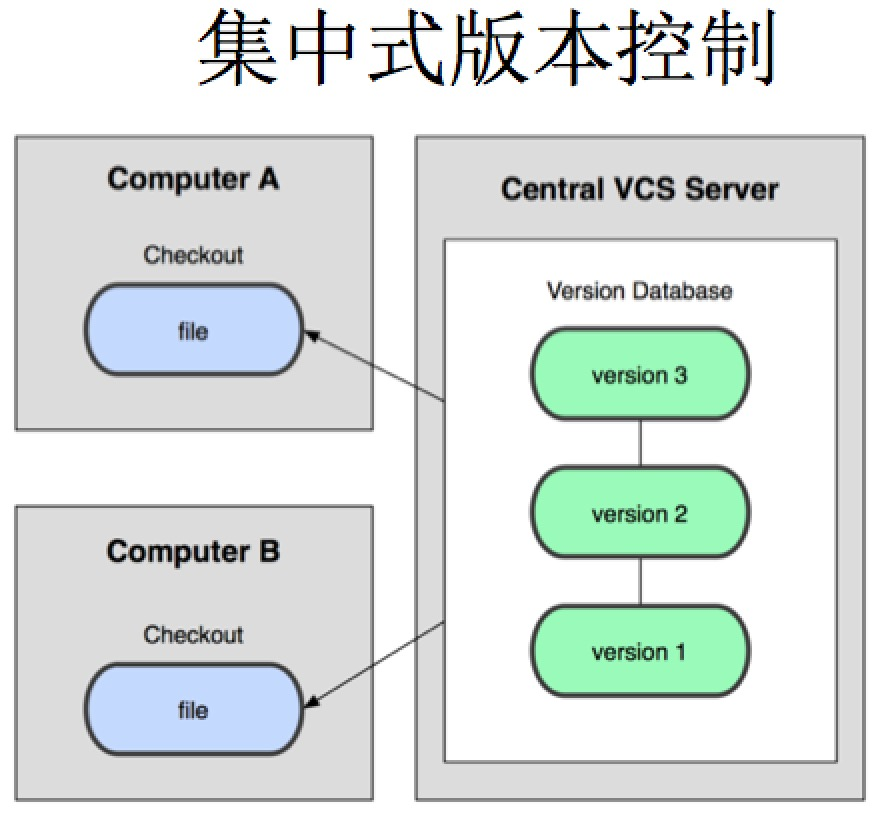
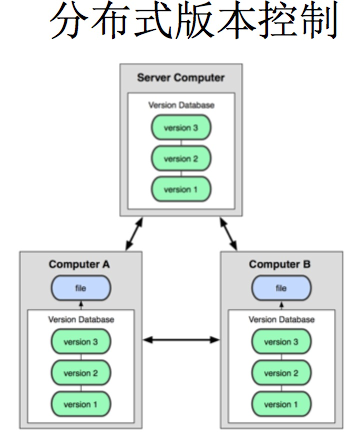
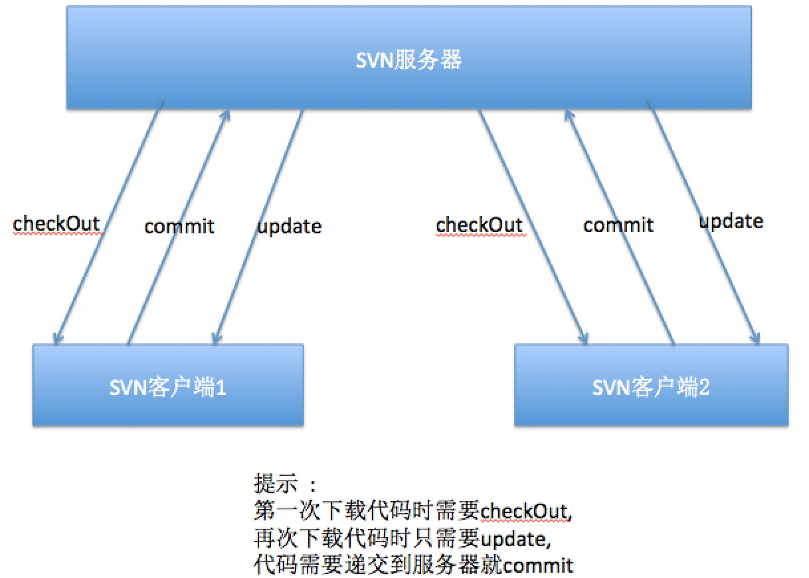
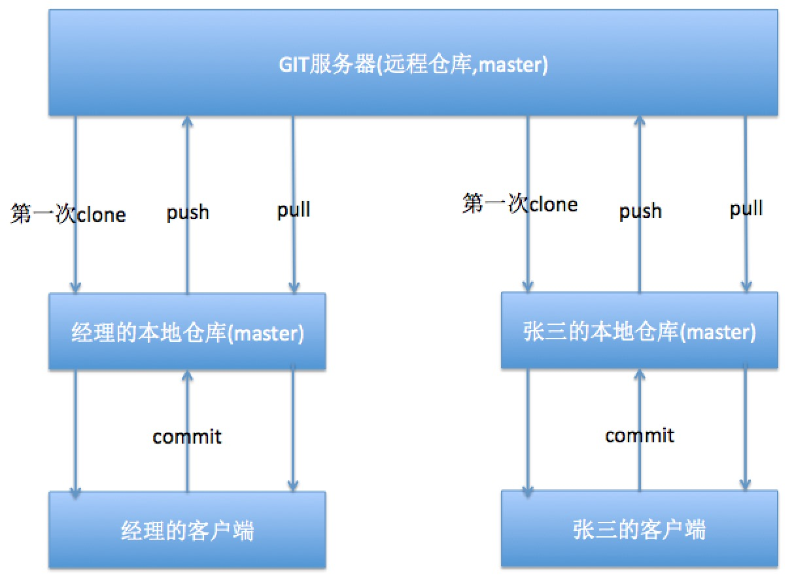
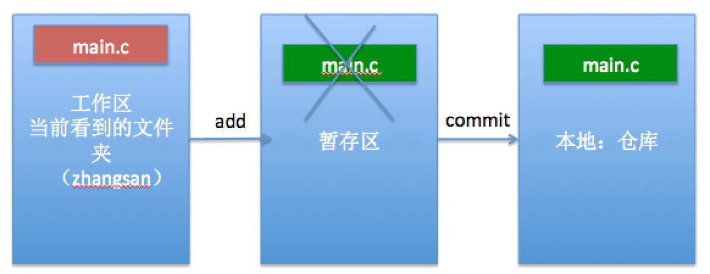
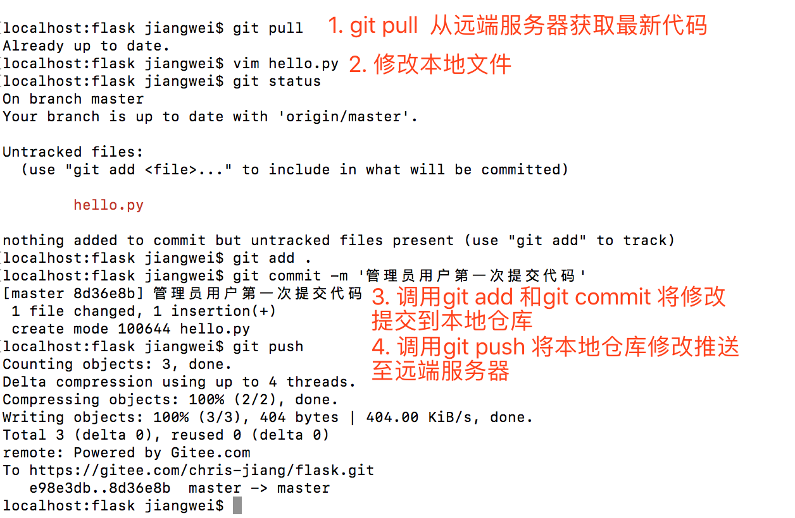
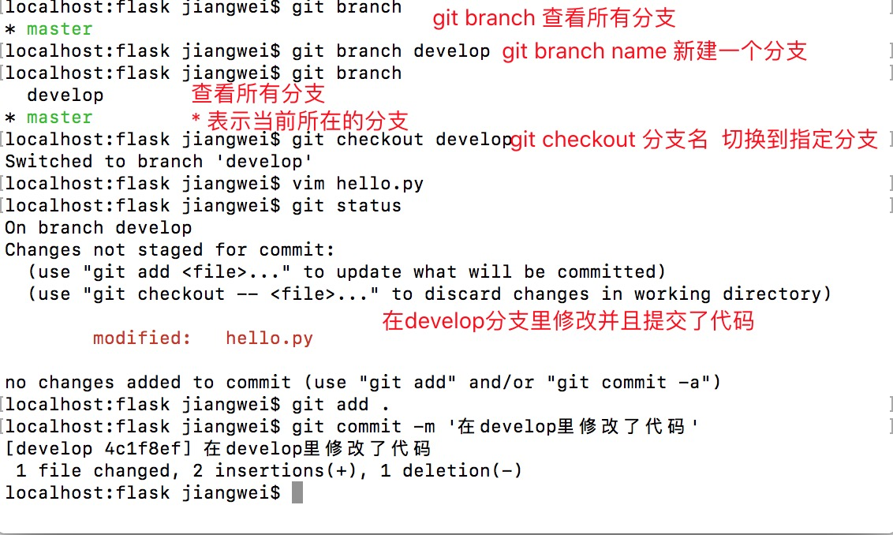
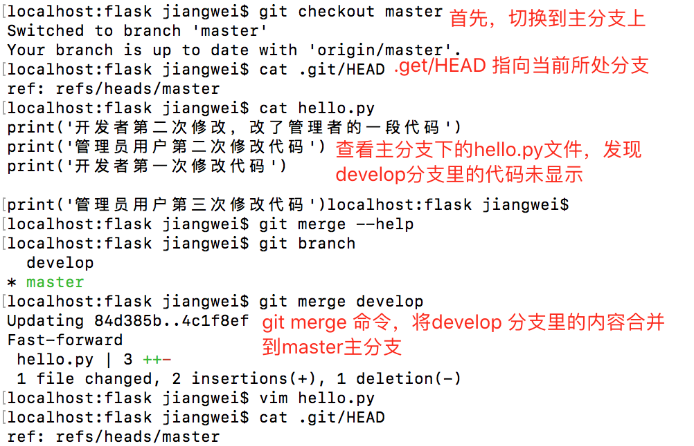

# GIT简介

## 作用

* 源代码管理

##为什么要进行源代码管理?

* 方便多人协同开发
* 方便版本控制


## svn 和 git 区别

### 管理方式不一样

```
1.SVN 是集中式管理.就是版本控制都在服务器上.
    缺点 : 万一服务器挂掉了,那么公司的多人协同开发和版本控制受阻

2.git 是分布式管理.服务器和客户端都有版本控制能力,都能进行代码的提交合并...
```



```
华丽的分割线
```



### 表现形式不一样

```
1.SVN 会在每个文件夹下面创建一个.svn的隐藏文件
    项目体积相对git管理的项目要大
    冲突相对git管理的项目要多

2.git 只会在根目录下创建一个.git隐藏文件夹
    项目体积相对svn管理的项目要小
    冲突相对svn管理的项目要少
```

### 所用到的地方不一样

```
svn 公司内部用,一般不会公布出去
git 开源项目用,单人开发常用，公司也使用
```

### svn 和 git 操作流程图解

```
svn 服务器 --> 客户端 --> 服务器
git 服务器 --> 本地 --> 客户端 --> 本地 --> 服务器
```

* SVN操作图解



* GIT操作图解



# GIT指令的使用

> 模拟自己在电脑上建项目,单人开发时的代码管理



## 本地操作

1.创建本地项目文件

```
/Users/chris/Desktop/lisi
```

> 以下终端命令都是在本地项目所在文件路径下进行的

2.在本地项目文件目录下,创建本地仓库(版本控制)

```
cd /Users/chris/Desktop/lisi
git init
```

3.在项目文件里面创建`hello.py`文件,用于版本控制演示

4.修改文件之后,查看修改之后和之前的比对

```
git diff
```

```
* 绿色表示新增,红色表示删除 / 修改
```

5.把新建的`hello.py`文件添加到本地仓库(版本控制)里面

```
git add .
```

6.查看当前版本控制里面的文件状态

```
git status
```
```
* 红色表示新建文件或者新修改的文件,都在`工作区`.
* 绿色表示文件在`暂存区`
```

> 提示 : 终端命令 `git add .` 只是把文件从`工作区`添加到`暂存区`,此时还没有到本地仓库,要到本地仓库需要 `commit .`

7.在`commit`之前,需要设置个人信息。可以添加  --global 参数，给所有的git仓库添加一个统一的配置项。这个配置项保存在  ~/.gitconfig文件里

```
配置用户名 : git config --global user.name "李四"    (区分责任人)
配置邮箱 : git config --global user.email "lisi@163.com" (方便联系作者)
```
​	也可以给这一个Git仓指定自己的用户名和邮箱。会保存在当前仓库.git/config文件里

```
配置用户名 : git config  user.name "lisi"    (区分责任人)
配置邮箱 : git config user.email "ls@126.com" (方便联系作者)
```

8.把文件从`暂存区`提交到`本地仓库`

```
git commit -m "操作描述"
```

9.把文件从`暂存区`提交到`本地仓库`之后,再查看版本控制里面的文件状态

```
git status
```

10.把先由`工作区`添加到`暂存区`,再提交到`本地仓库`合并成一句命令

```
git commit -am "操作描述"
```

11.查看所有的详细的历史版本

```
git reflog(可以看到被删除和回退过的提交记录)
或者
git log(不能看到已经删除和回退后的提交记录)
```

12.回到某个指定的版本

```
git reset --hard 版本号前6位
```

## Git远端服务器

1. 复制码云里的项目下载地址，使用git clone 命令将码云里的项目下载到本地。这个过程中，需要输入码云的注册用户名和码云用户密码。注意：只有被添加到项目里的成员和管理者才能下载代码

2. 代码的提交：当用户在本地操作完数据以后，需要调用git push将修改推送至远端服务器。

   

# GIT代码冲突

1. 容易出现冲突的操作方式
   * 多个人同时操作了同一个文件
   * 一个人一直写代码但是不提交
   * 修改代码之前，不更新代码
   * 提交之前，不更新最新代码
   * 擅自修改同事代码
2. 避免冲突
   * 养成良好的代码习惯,先`pull`在修改,修改完立即`commit`和`push`
   * 一定要确保自己正在修改的文件是最新版本的
   * 分模块开发,各自开发各自的模块
   * 如果要修改公共文件,一定要先确认有没有人正在修改
   * 下班前一定要提交代码,上班第一件事拉取最新代码
   * 一定不要擅自修改同事的代码

# Git分支

+ 分支的作用

  > 假设你准备开发一个新功能，但是需要两周才能完成，第一周你写了50%的代码，如果立刻提交，由于代码还没写完，不完整的代码库会导致别人不能干活了。如果等代码全部写完再一次提交，又存在丢失每天进度的巨大风险。 现在有了分支，就不用怕了。你创建了一个属于你自己的分支，别人看不到，还继续在原来的分支上正常工作，而你在自己的分支上干活，想提交就提交，直到开发完毕后，再一次性合并到原来的分支上，这样，既安全，又不影响别人工作。

+ 分支的本质

  >  Git分支的其实本质仅仅是指向提交对象的可变指针。 Git 的默认分支名字是 `master`。 在多次提交操作之后，你其实已经有一个指向最后那个提交对象的 `master` 分支。 它会在每次的提交操作中自动向前移动。
  >
  > `.git/HEAD`这个特殊指针来表示当前到底在哪个分支。

1. 创建本地分支

   

2. 分支合并

   

3. 查看本地分支和远程分支的映射关系。

   ```
   git branch -vv
   ```

4. 创建远程分支

   ```
   方式一:
   # 直接将本地develop分支的内容推送到远端的develop,并且将本地的develop分支和远端建立映射关系
   git push --set-upstream origin develop
   
   方式二:
   git push origin test:test  # 将本地的test分支推送到远端分支 test
   git branch --set-upstream-to origin/test # 将本地的test分支与与远端的test分支关联
   ```

5. 将远程分支拉取到本地

   ```
   git pull origin develop:develop  # 将远端上的develop分支拉取到本地的develop分支
   ```

6. 删除远端分支

   ```
   git push origin --delete develop  # 将远端分支develop删除
   ```

7. 分支的其他相关指令-

   - git fetch只是拿到远端的分支的最新commit_id，并不会自动合并，需要手动进行合并。

   - ```
     git fetch origin test  # 将远端test的最新commit_id获取到本地
     git merge origin/test test  # 将远端的test的修改内容合并到本地的test分支
     ```

   - git rebase用法和git merge 类似。

     ```
     git rebase 如果在合并时有冲突，需要手动解决冲突
     git add . # 标记为已解决所有冲突
     git rebase --abort  # 中止合并
     git rebase --continue 解决完冲突以后，不再git commit，而是使用git rebase --continue提交修改冲突后的数据
     ```

   # SSH链接

   码云生成部署SSH Key:http://git.mydoc.io/?t=154712

   gitHub生成SSH Key:https://help.github.com/articles/connecting-to-github-with-ssh/

   

   